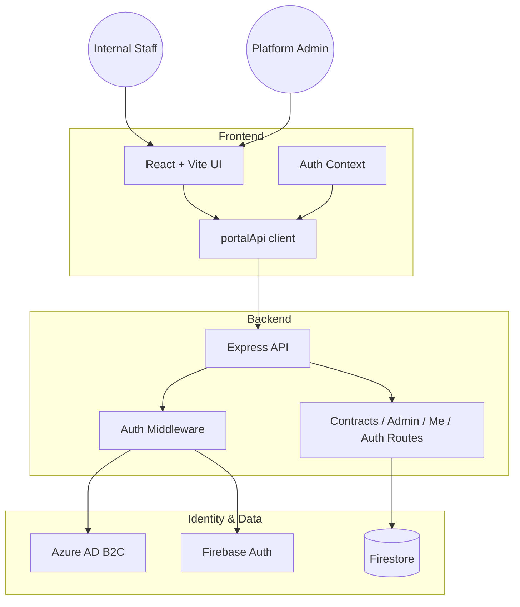
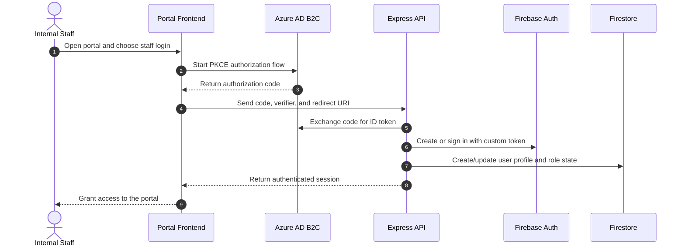
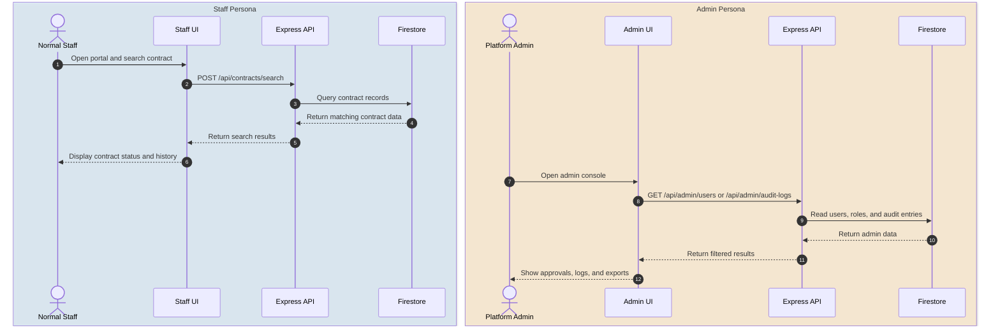

# Bridge Contract Status Portal - Design Specification

## Overview

Bridge Contract Status Portal is an enterprise-grade internal application for telecommunications staff to verify customer contract records. The current implementation uses a split architecture with a React/Vite frontend, an Express/TypeScript backend API, and Firebase Firestore for storage.

## Current Architecture

The portal now follows a backend-driven model:

- The frontend is a React + Vite application that renders the portal experience and calls the backend through the API client in [src/services/api.ts](src/services/api.ts).
- The backend in [backend/src/server.ts](backend/src/server.ts) exposes authenticated routes for auth, profile management, contract search,Excel import, purge operations, and admin workflows.
- Azure AD B2C handles enterprise login, while the backend exchanges the authorization code for a Firebase custom token and creates or updates the user profile in Firestore.
- Firebase Authentication and Firestore remain the runtime data and identity foundation, but direct browser-to-Firestore access is no longer the primary design.

## Project Structure

The implementation is now organized around a frontend and backend split:

- [src/components](src/components): reusable UI views such as the navbar, protected route, contract status badge, and loading states.
- [src/pages](src/pages): route-level screens including SearchPage and AdminPanel.
- [src/context/AuthContext.tsx](src/context/AuthContext.tsx): handles ADB2C initiation, callback handling, session timeout, and profile synchronization.
- [src/services/api.ts](src/services/api.ts): centralized frontend API client for backend routes.
- [backend/src/routes](backend/src/routes): API endpoints for auth, profile, contracts, and admin actions.
- [backend/src/middleware](backend/src/middleware): authentication and rate-limiting middleware.
- [backend/src/firebaseAdmin.ts](backend/src/firebaseAdmin.ts): backend-only Firestore and Firebase Admin initialization.

## Key Design Changes in the Current Build

### 1. Backend-mediated authentication
- The frontend starts an OAuth 2.0 PKCE flow with Azure AD B2C.
- The backend receives the authorization code and validates the incoming token with JWKS before issuing a Firebase custom token.
- The resulting session is bound to a Firestore profile that can carry role and status information.

### 2. Role-aware admin workflows
- Administrators and superadmins use the same portal UI but are authorized server-side through middleware.
- The admin routes support user status changes, role changes, deletion of user records, audit log viewing, and search-log export.
- Sensitive actions are written to audit logs and guarded by backend validation.

### 3. Contract operations moved to the API layer
- Search requests, Excel import, purge operations, and audit actions are executed through the backend.
- The backend validates request payloads, enforces size and rate limits, and writes audit records for privileged operations.

## Runtime Workflows

### Staff SSO Sequence

### Search and Admin Flow

## Data Model

### contracts
| Field | Type | Description |
|---|---|---|
| billingAccountNumber | string | Customer billing account identifier |
| msisdn | string | Mobile number or fibre-style identity value |
| contractStatus | string | Active or expired contract state |
| productName | string | Product name |
| contractName | string | Contract name |
| contractStartDate | string | Contract start date |
| contractEndDate | string | Contract end date |
| contractDuration | string | Human-readable duration |
| contractPenaltyAmount | number | Penalty amount |
| segment | string | Segment classification |
| updatedAt | timestamp | Server-side timestamp |

### users
| Field | Type | Description |
|---|---|---|
| uid | string | Firestore document ID and auth UID |
| username | string | Display name used in the UI |
| email | string | Primary email |
| adb2cEmail | string | ADB2C email used for identity mapping |
| authProvider | string | adb2c or firebase |
| role | string | user, admin, or superadmin |
| status | string | Active, Pending, or Rejected |
| createdAt | timestamp | Registration timestamp |
| lastLoginAt | timestamp | Latest login timestamp |

### audit_logs and search_logs
- These collections capture privileged actions and query activity for monitoring, auditing, and export.
- Search logs include the user identity, search scope, term, result count, and timestamp.

## Security and Operational Controls

- The backend validates bearer tokens from Azure AD B2C or Firebase before granting access.
- Middleware enforces authentication, admin, and superadmin authorization boundaries.
- Rate limiting and request-size controls protect the import and purge endpoints.
- The UI includes inactivity warnings and session expiration handling.
- Export actions and audit events are generated server-side to support traceability.

## Development Notes

- Frontend development runs from the Vite app in the repository root.
- Backend development runs from [backend](backend) using the TypeScript entrypoint in [backend/src/server.ts](backend/src/server.ts).
- The current setup is intended for internal use and assumes the relevant identity, Firebase, and storage configuration is available in the environment.
