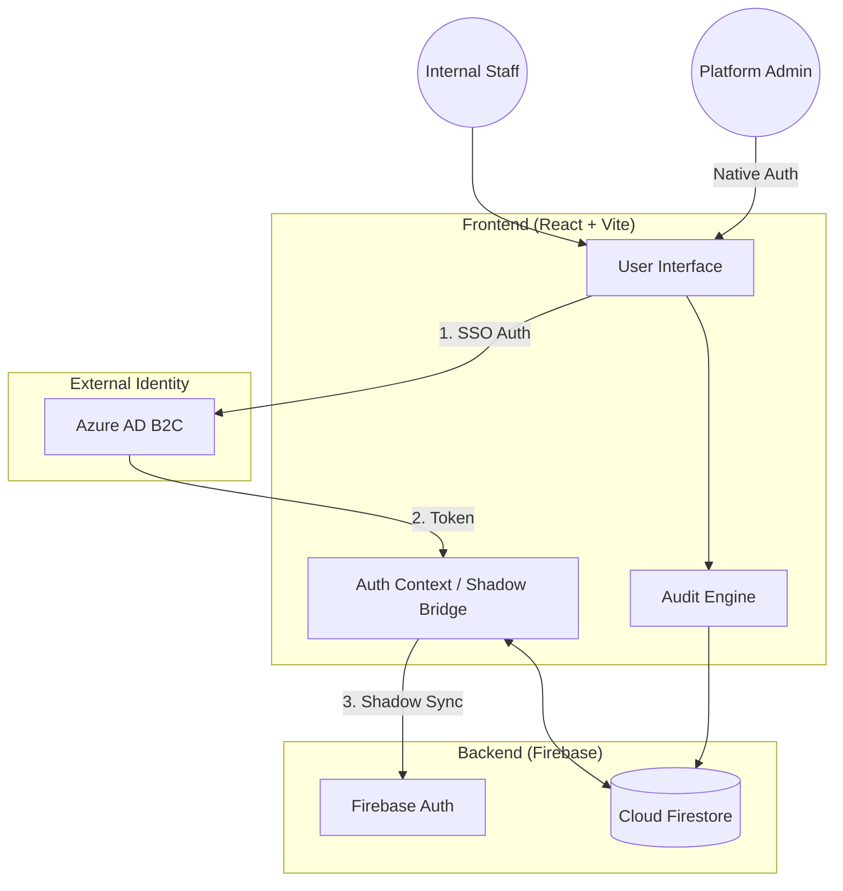
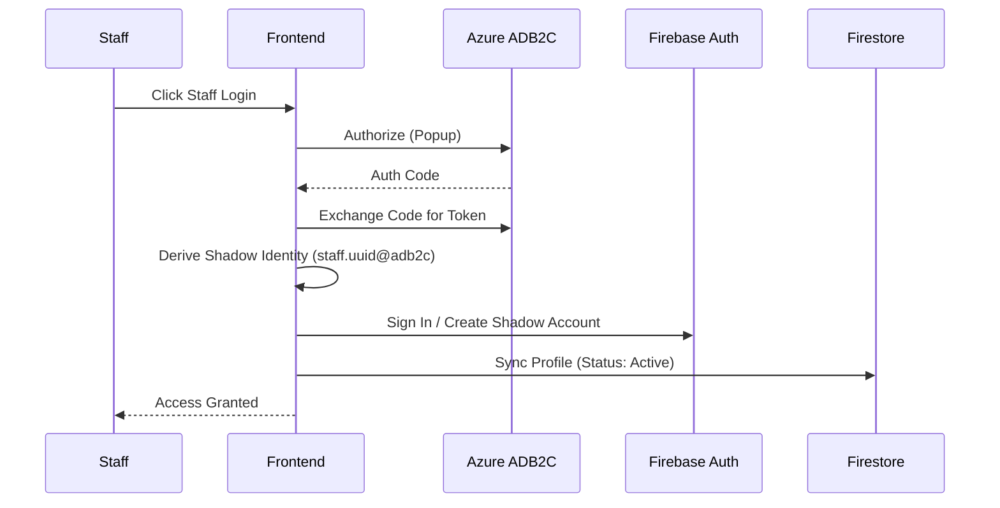

# Bridge Contract Status Portal - Design Specification

## Overview

Bridge Contract Status Portal is an enterprise-grade internal application designed for telecommunications staff to verify customer contract statuses. It features a hybrid identity architecture that bridges enterprise SSO (Azure AD B2C) with a high-security serverless backend (Firebase).

## System Architecture

The portal employs a "Bridge Identity" pattern. Internal staff authenticate via Azure AD B2C, and the application transparently maintains a "Shadow" Firebase account to leverage Firestore's robust Security Rules for role-based access.

## Project Structure

The application is organized into a modular structure to ensure scalability and maintainability:

- **`src/components/`**: Reusable UI components (Navbar, ProtectedRoute, ErrorBoundary, etc.).
- **`src/pages/`**: Page-level components representing different routes (Login, SearchPage, AdminPanel, DatabaseView).
- **`src/context/`**: React Context providers for global state management (**AuthContext** handles the ADB2C-to-Firebase bridge).
- **`src/types/`**: TypeScript interfaces and enums used across the project.
- **`src/utils/`**: Utility functions for Firestore error handling and data transformation.
- **`src/lib/`**: External library configurations (Tailwind merging).
- **`src/App.tsx`**: Clean entry point for routing and global providers.

## Key Components

### 1. Hybrid Authentication (`AuthContext`)

#### A. Azure AD B2C Integration
- **Flow**: Implements the OAuth 2.0 Authorization Code Flow with PKCE.
- **Experience**: The staff login is initiated via a secure popup window. After success, the popup communicates back to the main window using `window.postMessage`, ensuring a seamless user experience without page reloads.

#### B. The "Shadow Identity" Pattern
- **Purpose**: Azure AD B2C provides identity, but Firestore requires Firebase Auth for fine-grained security rule execution.
- **Mechanism**: Upon successful ADB2C login, the system derives a deterministic "Shadow Email" (e.g., `staff.<oid>.adb2c@celcomdigi.com`).
- **Sync**: The frontend automatically manages a Firebase Auth session for this shadow identity. This bridges the gap, allowing Staff to use their real credentials while the database stays secured by Firebase-native rules.

#### C. Privacy & Data Integrity
- **Administrative Access**: Administrators use standard Firebase Auth. Profiles for non-staff accounts start as `Pending` and require manual approval.
- **Auto-Activation**: Verified ADB2C staff are automatically granted `Active` status on their first sync, bypassing the manual approval queue.
- **Profile Redaction**: For CelcomDigi internal accounts, usernames are extracted from email prefixes to preserve privacy in audit logs.

### 2. Audit Logs & Search Analytics
- **Accounting**: Every sensitive administrative action (Role changes, Bulk imports) and every user search query is logged.
- **Search Logs**: Captures the `userId`, `username`, `searchTerm`, and `timestamp`. This is critical for detecting bulk-scraping attempts and monitoring platform health.
- **Security**: Logs are append-only. Rules prevent users from modifying or deleting their own logs.

### 3. Search Engine (`SearchPage`)
- **Query Hardening**: Every search interaction is constrained by a `limit(10)` function at the client level and validated by a `limit <= 100` rule at the database level.
- **Fibre vs Mobile**: Targeted querying logic ensures that Fibre username searches only hit records with domain-inclusive entries, preventing cross-contamination of search results.

## System Workflows

### Staff SSO Sequence (SSO Bridge)

## Data Model (Firestore)

### `contracts` Collection
| Field | Type | Description |
|-------|------|-------------|
| `billingAccountNumber` | string | Unique customer billing ID |
| `msisdn` | string | Mobile number |
| `contractStatus` | string | "CONTRACT ACTIVE" or "CONTRACT EXPIRED" |
| `updatedAt` | timestamp | Server-side timestamp |

### `users` Collection
| Field | Type | Description |
|-------|------|-------------|
| `uid` | string | Primary Key (Auth UID) |
| `adb2cEmail` | string | The Shadow Email (used for Rule verification) |
| `status` | string | Pending / Active / Rejected |
| `role` | string | user / admin / superadmin |

## Performance Optimization

1. **Deterministic Document IDs**: Contracts use composite IDs (`msisdn_account`). This allows O(1) lookups and efficient delta-updates during Excel imports.
2. **Throttled Metadata**: User activity tracking only triggers a database write once every 24 hours per session to minimize write units.
3. **Manual Aggregate Sync**: Global database stats are not auto-loaded. Admins trigger a manual count to save on read units.

## Security Controls

- **Rule-Level Validation**: Security rules verify the `adb2cEmail` field in the user profile against the authenticated ID token's email.
- **Time-Locked Tokens**: Sessions are strictly monitored for inactivity with visual countdown warnings.
- **Identity Redaction**: Real emails are never stored in the `contracts` or `audit_logs` collections.
