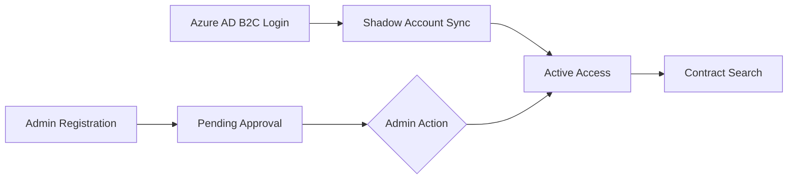

# 🌉 Bridge Contract Status Portal (Enterprise Edition)

An enterprise-grade internal portal for managing, searching, and verifying customer contract records. This platform is engineered for high-security environments, featuring automated data integrity checks and strict role-based access control.

## 🚀 Key Features

### 🔐 Security & Hybrid Access Control
- **Azure AD B2C (SSO) Integration**: Seamless enterprise login for internal staff using Microsoft Azure AD B2C. Supports secure PKCE (Proof Key for Code Exchange) flow.
- **Shadow Identity Architecture**: Staff enterprise identities are bridged to Firebase using a deterministic "Shadow Account" system (`staff.<uuid>.adb2c@celcomdigi.com`), ensuring high-security standard-based auth while maintaining precise Firestore permission control.
- **Privacy-First Design**: For administrative accounts, user emails are prioritized for identification. For standard records and logs, pseudonymized usernames extracted from email prefixes are used for internal tracking.
- **Role Hierarchy**: Tiered access levels for **SuperAdmins** (system configuration), **Admins** (data management), and **Users** (record verification).
- **Hierarchical Audit Logs**: Administrative actions are tracked with visibility based on role (SuperAdmins see all; Admins see Admin/User actions only), using redacted identities for logging.
- **Brute-Force Protection**: Automatic login lockdown (30-second penalty) after 5 consecutive failed attempts for administrative login paths.
- **Intelligent Session Management**: 10-minute inactivity timeout with a **2-minute visual countdown warning** modal to protect sensitive MSISDN data on idle screens.
- **Auto-Approval for Enterprise Staff**: Staff logging in via ADB2C are automatically granted `Active` status, while administrative accounts require manual oversight.
- **PII Integrity**: MSISDN and Billing Account Number data access is guarded by strict Firebase Security Rules that verify the origin of the authenticated token.

## 🔄 System Flow

### 📊 Database Intelligence
- **Intelligent Deduplication**: Smart Excel import logic that uses deterministic ID generation (`MSISDN_AccountNumber`) to prevent duplicate entries and automatically update existing records.
- **Bulk Data Engine**: Powerful Excel (.xlsx/.xls) processing with flexible column mapping and real-time import status feedback.
- **Search Analytics**: Comprehensive logging of user search terms to monitor platform utilization and detect potential bulk-scraping patterns.
- **System Audit Core**: Tracking of all administrative actions (Role swaps, Status changes, Bulk uploads, and Deletions) for total accountability.
- **Automated Intelligence**: Real-time calculation of "Remaining Months" and "Contract Status" (Active/Expired) based on dynamic date parsing.

### 🎨 User Experience
- **Multipane Login Interface**: Distinct paths for Internal Staff (ADB2C) and Platform Administrators (Firebase Auth).
- **Popup-Driven Auth Flow**: Modern login experience using a secure auth popup and cross-window `postMessage` communication to handle redirects without losing portal state.
- **Fluid Interface**: Accelerated UI powered by Tailwind CSS 4.0 and Framer Motion for high-density, professional data visualization.
- **Resilient Search**: Instant search history and multi-index querying (MSISDN / Account Number / Fibre Username).
- **History Intelligence**: Historical search items populate inputs for refined control, preventing accidental redundant queries.
- **Audit Exports**: One-click **CSV/Excel Export** functionality in search results with automated audit naming conventions (Account_Date).

## ⚡ Performance & Scale Optimization

The portal is engineered to handle massive datasets (50,000+ records) efficiently while staying within cost and quota limits:
- **Cost-Enforced Rules**: Firestore Security Rules strictly enforce `request.query.limit <= 100`, preventing accidental "Collection Scans" that spike read counts.
- **On-Demand Aggregation**: Total asset counts are no longer computed automatically on page load. Admins can trigger a **Manual Sync** to refresh global statistics, drastically reducing read-unit consumption.
- **Intelligent Caching**: User profiles are cached in `localStorage` with a 24-hour TTL, allowing the portal to remain functional for authenticated users even during temporary backend service throttling.
- **Query Hardening**: Every database interaction is wrapped in a mandatory `limit()` query object, ensuring the application never fetches more data than the browser can safely process.
- **Throttled Metadata**: User status and login timestamps are updated only once per 24 hours per session, minimizing redundant write operations.

## 🛠 Tech Stack

- **Frontend**: React 18 & Vite (TypeScript)
- **Authentication**: Azure AD B2C (OpenID Connect) & Firebase Auth (Bridge)
- **Infrastructure**: Firebase (Firestore)
- **Styling**: Tailwind CSS 4.0, Framer Motion
- **Processing**: XLSX Core (Excel Processing), Crypto-JS (Token Verification)

## 🏗 Setup & Deployment

1. **Azure Configuration**: Set up an ADB2C Tenant and Register the Spa with valid Redirect URIs (`/login`).
2. **Firebase**: Project must be provisioned via the `set_up_firebase` tool.
3. **Security Rules**: Deploy the provided `firestore.rules` which contains specific `isValidUser()` logic for ADB2C shadow accounts.
4. **Environment**: Ensure `VITE_ADB2C_CLIENT_ID`, `VITE_ADB2C_TENANT_ID`, `VITE_ADB2C_POLICY`, and the required Firebase Vite variables are correctly configured.

5. **Secrets**: Keep backend-only secrets in environment variables or Google Secret Manager. Do not commit `backend/serviceAccountKey.json` or other credentials to the repository.

---
**Confidential & Internal Use Only**  
*Maintained by CelcomDigi Internal Operations Team*
