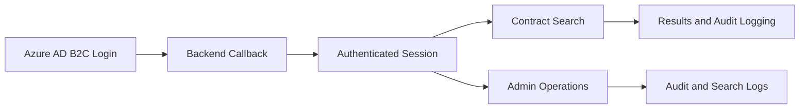

# 🌉 Bridge Contract Status Portal

An internal portal for verifying contract records, supporting staff search workflows and administrator operations. The current implementation is backed by a React/Vite frontend and a dedicated Express/TypeScript API layer.

## 🚀 What is new in the current build

- A backend API now handles contract search, Excel import, purge operations, user profile management, and administration endpoints.
- Azure AD B2C authentication is initiated from the frontend and completed through the backend callback flow.
- The admin experience now supports role and status changes, user deletion, audit review, search-log export, and rate-limited mutation actions.
- The UI includes session timeout warnings and a richer contract search experience with recent-history support.

## 🔐 Security and access model

- Internal staff use Azure AD B2C login and are bridged into Firebase-backed profiles.
- The backend validates bearer tokens, then applies role checks through middleware for authentication, admin access, and superadmin access.
- Sensitive actions are audited and protected by server-side validation and rate limits.
- Search and admin requests are routed through the API rather than being executed directly from the browser.

## 🔄 Main user flow



## 🧩 Core capabilities

- Search contracts by MSISDN, billing account number, or fibre username.
- Display calculated contract status and remaining months from contract dates.
- Import Excel or CSV files through the backend with validation and duplicate handling.
- Review and export search logs to CSV/Excel-compatible format.
- Manage user statuses, roles, and approvals via the admin console.

## 🛠 Tech stack

- Frontend: React, Vite, TypeScript
- UI: Tailwind CSS and Motion
- Backend: Express + TypeScript
- Identity: Azure AD B2C and Firebase Authentication
- Data: Firestore
- Importing: XLSX and Excel parsing helpers

## ▶️ Running the project

### Frontend
```bash
npm install
npm run dev
```

### Backend
```bash
cd backend
npm install
npm run dev
```

## ⚙️ Configuration notes

The frontend expects the standard Vite environment values for Azure AD B2C, while the backend requires its own identity and Firebase configuration values for token verification and Firestore access.

In practice, this means:
- configure the frontend ADB2C variables for login initiation,
- configure the backend for Entra/ADB2C token verification and Firebase Admin access,
- keep secrets out of the repository and use environment variables or a secret manager where appropriate.

## 📌 Implementation notes

- The frontend uses [src/services/api.ts](src/services/api.ts) for all API calls.
- Contract and admin business logic now sits in the backend routes under [backend/src/routes](backend/src/routes).
- The auth layer is handled by [backend/src/middleware/auth.ts](backend/src/middleware/auth.ts) and the API entrypoint is [backend/src/server.ts](backend/src/server.ts).

---
**Confidential & Internal Use Only**
*Maintained by the Bridge Portal engineering team*
