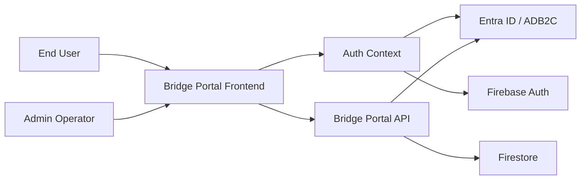
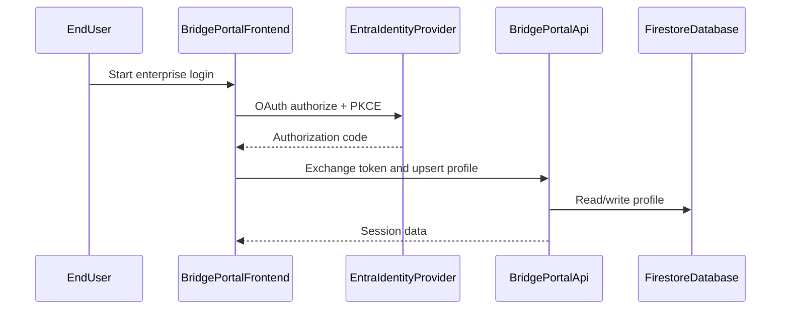
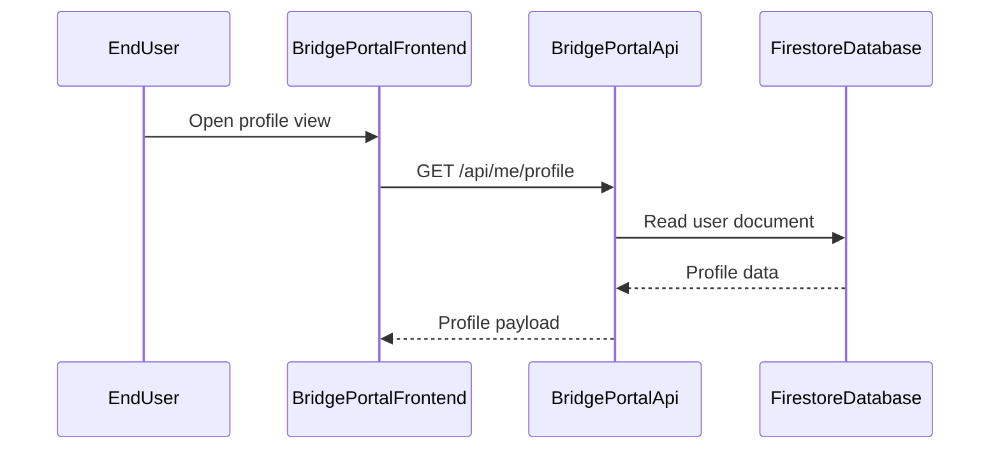
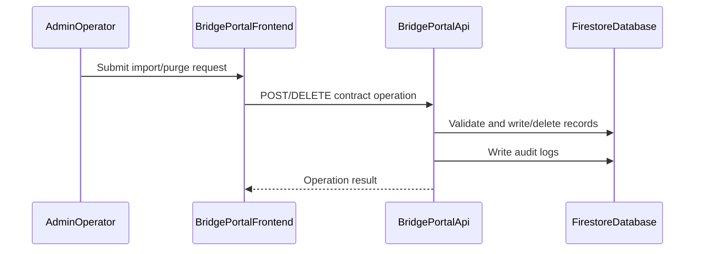

# Architecture Overview

## System Purpose

Bridge Portal is a staff-facing web application that combines a React frontend, an Express API, Firebase Authentication, and Firestore-backed profile and contract data. The system supports enterprise sign-in through Azure AD B2C/Entra, user profile management, contract searches, and admin operations.

## Key Components

| Component | Type | Description |
|-----------|------|-------------|
| BridgePortalFrontend | Process | React/Vite web client that renders the login experience, profile state, and admin screens. |
| AuthContext | Process | Frontend auth orchestration layer that manages PKCE login, callback exchange, and profile hydration. |
| FirebaseAuth | External Service | Firebase Authentication service used for client-side auth state and custom-token exchange. |
| BridgePortalApi | Process | Express backend that validates bearer tokens, serves profile and contract APIs, and writes to Firestore. |
| FirestoreDatabase | Data Store | Firestore database holding users, contracts, audit logs, and search logs. |
| EntraIdentityProvider | External Service | Azure AD B2C / Entra identity provider used for enterprise user authentication. |
| AdminOperator | External Interactor | Privileged administrator managing users and contract data. |
| EndUser | External Interactor | Staff user accessing the portal and its search features. |

## Component Diagram

## Top Scenarios

### Scenario 1: Staff sign-in via enterprise identity

A staff member authenticates through Entra ID/ADB2C, exchanges the authorization code in the browser, and obtains a Firebase custom token to reach the backend APIs.

### Scenario 2: Profile retrieval and update

An authenticated user loads and updates their profile. The backend validates the bearer token and persists profile settings in Firestore.

### Scenario 3: Contract import and purge operations

An admin imports a batch of contract records or performs a destructive purge. The backend validates the payload and writes audit logs.

## Technology Stack

| Layer | Technologies |
|-------|--------------|
| Languages | TypeScript, JavaScript |
| Frameworks | React, Vite, Express, Firebase SDK |
| Data Stores | Firestore |
| Infrastructure | Docker, Nginx, Google Cloud / Firebase hosting patterns |
| Security | Firebase Auth, Entra ID / ADB2C, Helmet, CORS, JWT validation |

## Deployment Model

The application is a browser-based client plus an Express API service, with Firestore as the primary datastore. The frontend is served through a Vite/hosted web stack, the backend runs as an API service, and the Firestore rules govern client access to persistent data.

**Deployment Classification:** `NETWORK_SERVICE`

### Component Exposure Table

| Component | Listens On | Auth Required | Reachability | Min Prerequisite | Derived Tier |
|-----------|------------|---------------|--------------|------------------|-------------|
| BridgePortalFrontend | N/A — no listener | No | External | None | T1 |
| AuthContext | N/A — no listener | No | No Listener | Host/OS Access | T3 |
| FirebaseAuth | N/A — external service | Yes | External | Authenticated User | T2 |
| BridgePortalApi | 0.0.0.0:8080 | Yes | External | Authenticated User | T2 |
| FirestoreDatabase | N/A — managed service | Yes | Internal Only | Internal Network | T2 |
| EntraIdentityProvider | N/A — external service | Yes | External | Authenticated User | T2 |
| AdminOperator | N/A — human actor | Yes | External | Privileged User | T2 |
| EndUser | N/A — human actor | No | External | None | T1 |

## Security Infrastructure Inventory

| Component | Security Role | Configuration | Notes |
|-----------|---------------|---------------|-------|
| Entra Identity Provider | Identity provider | OAuth2 / PKCE in frontend and token validation in backend | Stronger issuer validation is required for production hardening. |
| Firestore Rules | Access control | Custom rules for users, contracts, audit logs, and search logs | Rules were recently hardened locally but must be deployed to Firebase. |
| Firebase Auth | Authentication | Custom-token exchange and Firebase ID tokens | Used as a session bridge for the frontend/backend flow. |
| Helmet / CORS | Web hardening | Express middleware configured with CORS allowlist | Basic protection is present but should be verified against deployment origins. |

## Repository Structure

| Directory | Purpose |
|-----------|---------|
| backend/ | Express API, auth middleware, Firestore integration, route handlers |
| src/ | React frontend, auth context, pages, API client, Firebase config |
| firestore.rules | Firestore access rules |
| skills/ | Threat-model and coding guidance assets |
