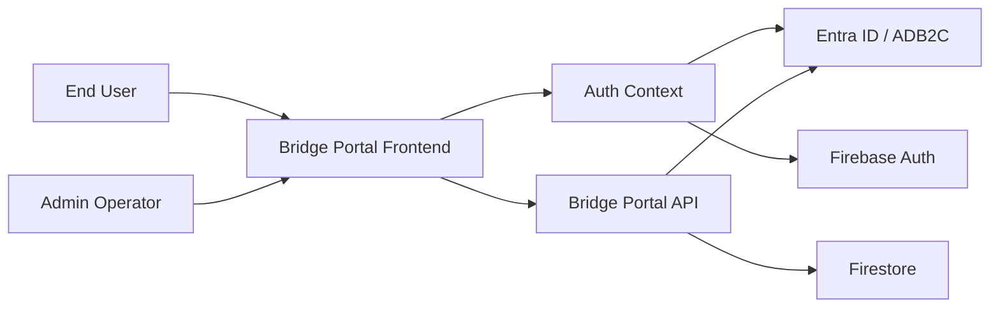

# Threat Model

## Data Flow Diagram

## Element Table

| Element | Type | TMT Category | Description | Trust Boundary |
|---------|------|--------------|-------------|----------------|
| EndUser | External Interactor | SE.EI.TMCore.User | Staff user interacting with the portal. | External |
| BridgePortalFrontend | Process | SE.P.TMCore.WebSvc | React/Vite client that hosts the login and admin experience. | Application |
| AuthContext | Process | SE.P.TMCore.WebSvc | Frontend auth and callback orchestration logic. | Application |
| FirebaseAuth | External Service | SE.EI.TMCore.Identity | Firebase Authentication service used by the client. | External |
| BridgePortalApi | Process | SE.P.TMCore.WebSvc | Express API handling profile, search, and admin endpoints. | Application |
| FirestoreDatabase | Data Store | SE.DS.TMCore.NoSQLDB | Firestore database storing user and contract data. | DataStorage |
| EntraIdentityProvider | External Service | SE.EI.TMCore.Identity | Azure AD B2C / Entra identity provider. | External |
| AdminOperator | External Interactor | SE.EI.TMCore.User | Privileged operator managing the system. | External |

## Data Flow Table

| ID | Source | Target | Protocol | Description |
|----|--------|--------|----------|-------------|
| DF01 | EndUser | BridgePortalFrontend | HTTPS | User initiates login and searches. |
| DF02 | BridgePortalFrontend | AuthContext | Browser runtime | Client-side auth state and callback handling. |
| DF03 | AuthContext | EntraIdentityProvider | OAuth2 / PKCE | Authorization code flow for enterprise identity. |
| DF04 | AuthContext | FirebaseAuth | HTTPS | Custom-token exchange and Firebase session initialization. |
| DF05 | BridgePortalFrontend | BridgePortalApi | HTTPS | Profile, contract, and admin API requests. |
| DF06 | BridgePortalApi | FirestoreDatabase | Firestore SDK / REST | Read and write of user, contract, and audit data. |
| DF07 | AdminOperator | BridgePortalFrontend | HTTPS | Admin management actions. |
| DF08 | BridgePortalApi | EntraIdentityProvider | JWT validation | Backend token verification for Entra-issued identities. |

## Trust Boundary Table

| Boundary | Description | Contains |
|----------|-------------|----------|
| External | Internet-facing actors and identity providers. | EndUser, AdminOperator, EntraIdentityProvider, FirebaseAuth |
| Application | Browser client and API service running in the application tier. | BridgePortalFrontend, AuthContext, BridgePortalApi |
| DataStorage | Firestore persistence boundary. | FirestoreDatabase |
