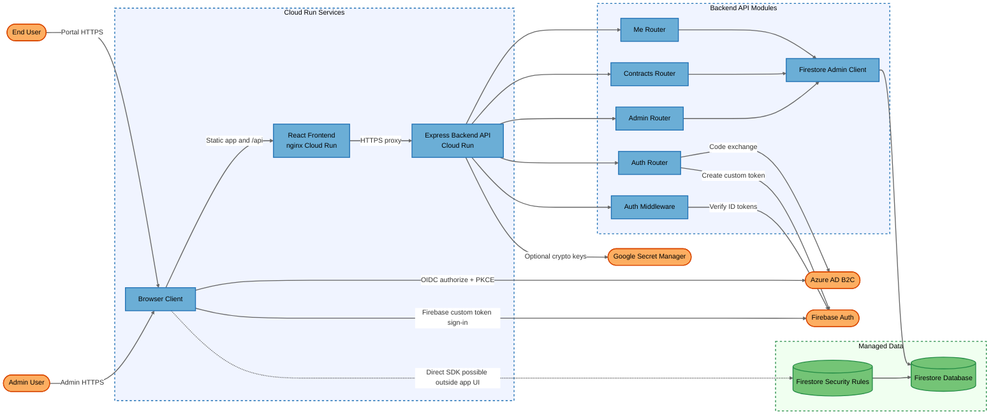
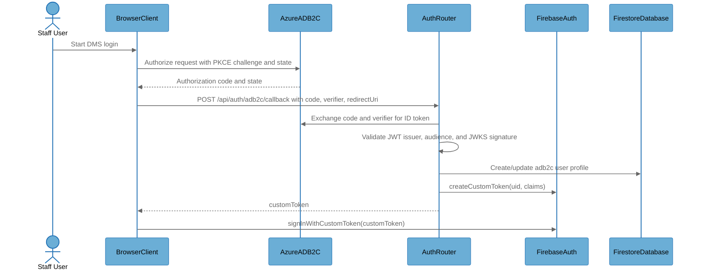
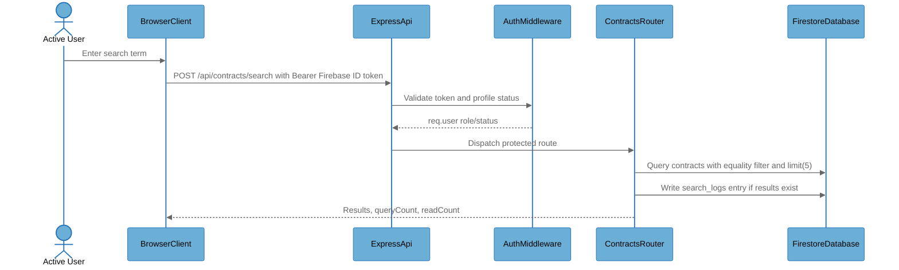
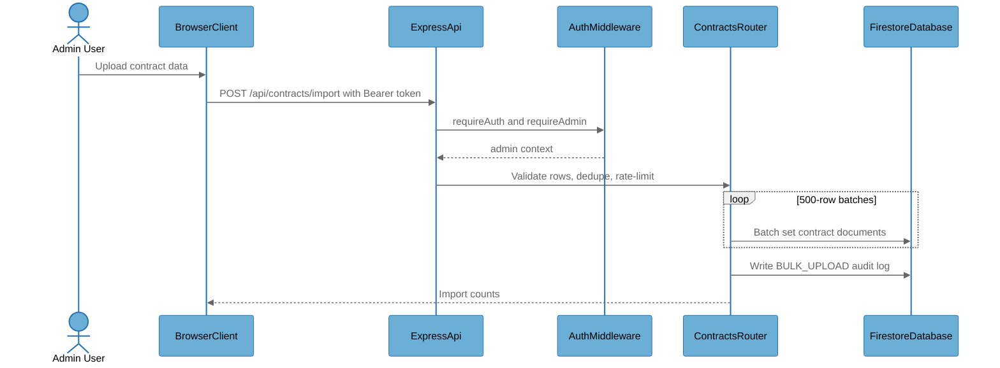

# Architecture Overview

## System Purpose

Bridge Portal is an internal contract-status portal for searching customer contract records, importing contract datasets, and administering portal users. The current architecture routes application data access through an Express backend API instead of letting the React frontend perform business Firestore operations directly. Authentication combines Azure AD B2C Authorization Code Flow with PKCE, backend code exchange, Firebase custom token issuance, and Firebase ID token validation on protected backend routes.

## Key Components

| Component | Type | Description |
|-----------|------|-------------|
| EndUser | External Interactor | Staff or business user accessing contract search workflows from a browser. |
| AdminUser | External Interactor | Administrator using the portal for user, audit, import, and purge operations. |
| BrowserClient | Process | React SPA runtime using Firebase Auth, ADB2C PKCE helpers, and the typed backend API client. |
| NginxFrontend | Process | Cloud Run nginx container serving the built React app and proxying `/api/` calls to the backend. |
| ExpressApi | Process | Public Cloud Run Express API with Helmet, CORS allow-listing, JSON parsing, route dispatch, and error handling. |
| AuthRouter | Process | Backend auth endpoints for username resolution and Azure AD B2C code exchange to Firebase custom tokens. |
| AuthMiddleware | Process | Backend bearer token validator for Azure AD B2C JWTs and Firebase ID tokens plus role/status profile hydration. |
| MeRouter | Process | Authenticated profile read and update API. |
| ContractsRouter | Process | Authenticated search API plus admin import and superadmin purge endpoints. |
| AdminRouter | Process | Admin user-management, audit-log, and search-log APIs. |
| FirestoreAdminClient | Process | Firebase Admin SDK wrapper, service-account/application-default credential resolver, and REST Firestore transport. |
| FirestoreDatabase | Data Store | Managed Firestore collections for users, contracts, audit logs, and search logs. |
| FirestoreRules | Data Store | Firestore Security Rules policy for direct Firebase client access. |
| FirebaseAuth | External Service | Firebase Auth verifies ID tokens and accepts backend-created custom tokens. |
| AzureADB2C | External Service | Azure AD B2C identity provider and JWKS/token endpoints. |
| GoogleSecretManager | External Service | Optional AES-GCM key storage used by the backend Excel crypto service. |
| CloudBuildCloudRun | Process | Cloud Build YAML and Cloud Run deployment configuration for frontend/backend services. |

## Component Diagram

## Top Scenarios

### Scenario 1: Staff ADB2C Login to Firebase Session

The browser creates a PKCE verifier/challenge and starts an Azure AD B2C authorization request. The backend receives the authorization code and verifier, exchanges the code with Azure AD B2C, validates the returned ID token, creates or updates the Firestore user profile, mints a Firebase custom token, and the frontend completes `signInWithCustomToken()`.

### Scenario 2: Contract Search Through Backend API

An authenticated user searches by MSISDN, billing account number, or username. The frontend sends a Firebase ID token to the Express API, middleware loads the user profile and enforces active status, and the contracts route performs bounded Firestore queries and writes a search log when results exist.

### Scenario 3: Admin Bulk Import and Purge

Admins import contract rows through the backend API, which validates payload shape, deduplicates deterministic document IDs, batches writes, rate limits the endpoint, and writes an audit log. Superadmins can purge contracts only through a separate endpoint requiring role middleware, rate limiting, and a confirmation token.

### Scenario 4: Admin User and Log Management

The admin panel calls backend APIs for user listing, status updates, role updates, deletion, audit logs, and search logs. `requireAdmin` applies to the router, and `requireSuperAdmin` applies to role changes and contract purge.

### Scenario 5: Direct Firestore Policy Backstop

Although normal application data flows use the backend API, a signed-in Firebase user can still attempt direct Firestore SDK or REST calls. Firestore Security Rules remain a critical backstop and must align with backend authorization invariants.

## Technology Stack

| Layer | Technologies |
|-------|--------------|
| Languages | TypeScript, JavaScript, Firestore Rules, YAML, Dockerfile, nginx config |
| Frameworks | React, Vite, Express, Firebase client SDK, Firebase Admin SDK |
| Data Stores | Firestore collections: users, contracts, audit_logs, search_logs |
| Infrastructure | Google Cloud Run, Cloud Build, Artifact Registry, nginx, Docker |
| Security | Azure AD B2C OIDC with PKCE, Firebase Auth custom tokens, jose JWT verification, Helmet, CORS allow-list, backend RBAC middleware, Firestore Security Rules, Google Secret Manager, AES-256-GCM helper |

## Deployment Model

The codebase describes a two-service public Cloud Run deployment. The frontend nginx container listens on port 8080 and proxies `/api/` to the backend Cloud Run service over HTTPS. The backend Express API listens on `PORT` or 8080 and is deployed with `--allow-unauthenticated`; all protected routes rely on application-level bearer token validation and role middleware. Firestore and Firebase Auth are managed external services, and backend secrets are expected to be injected through Cloud Run Secret Manager bindings.

**Deployment Classification:** `NETWORK_SERVICE`

### Component Exposure Table

| Component | Listens On | Auth Required | Reachability | Min Prerequisite | Derived Tier |
|-----------|------------|---------------|--------------|------------------|-------------|
| EndUser | N/A - no listener | No | No Listener | Host/OS Access | T3 |
| AdminUser | N/A - no listener | No | No Listener | Host/OS Access | T3 |
| BrowserClient | N/A - browser runtime | Yes (Firebase session after login) | No Listener | Host/OS Access | T3 |
| NginxFrontend | 0.0.0.0:8080 in Cloud Run | No for static assets | External | None | T1 |
| ExpressApi | 0.0.0.0:8080 in Cloud Run | Mixed: public auth endpoints, bearer token on protected APIs | External | None | T1 |
| AuthRouter | `/api/auth/*` under ExpressApi | No for resolve-login and callback pre-token | External | None | T1 |
| AuthMiddleware | Express middleware, no independent listener | Yes (Bearer ADB2C or Firebase token) | External | Authenticated User | T2 |
| MeRouter | `/api/me/*` under ExpressApi | Yes (requireAuth) | External | Authenticated User | T2 |
| ContractsRouter | `/api/contracts/*` under ExpressApi | Yes (requireAuth; admin/superadmin for mutations) | External | Authenticated User | T2 |
| AdminRouter | `/api/admin/*` under ExpressApi | Yes (requireAdmin; requireSuperAdmin for role update) | External | Privileged User | T2 |
| FirestoreAdminClient | N/A - outbound SDK wrapper | Service account credentials | No Listener | Host/OS Access | T3 |
| FirestoreDatabase | Managed Firestore endpoint | Firebase/Google IAM and Firestore Rules | External | Authenticated User | T2 |
| FirestoreRules | Firestore policy evaluator | Firebase Authentication context | External | Authenticated User | T2 |
| FirebaseAuth | Managed public auth endpoints | Provider-specific credentials/tokens | External | None | T1 |
| AzureADB2C | Managed public OIDC endpoints | OIDC controls | External | None | T1 |
| GoogleSecretManager | Managed Google API | Cloud Run service account IAM | External | Admin Credentials | T3 |
| CloudBuildCloudRun | Cloud Build config and deployment process | GCP IAM | No Listener | Admin Credentials | T3 |

## Security Infrastructure Inventory

| Component | Security Role | Configuration | Notes |
|-----------|---------------|---------------|-------|
| AuthMiddleware | Backend authentication and authorization context | `jwtVerify()` for ADB2C, `admin.auth().verifyIdToken()` for Firebase | Protected routes use this middleware. |
| requireAdmin | Backend admin authorization | Allows `admin` and `superadmin` roles | Used by admin router and contract import. |
| requireSuperAdmin | Backend superadmin authorization | Allows only `superadmin` | Used by role updates and contract purge. |
| AuthRouter | ADB2C code exchange and Firebase custom token bridge | Exchanges `code` + `codeVerifier`, validates ID token, creates custom token | Central identity bridge. |
| FirestoreRules | Direct client access backstop | Default deny, role helpers, validation, limited list queries | Must not conflict with backend approval state. |
| Helmet | HTTP hardening | `app.use(helmet())` | Provides common security headers on backend. |
| CORS allow-list | Browser-origin restriction | `ALLOWED_ORIGINS` list in config and Cloud Build | Allows configured origins only. |
| RateLimiter | Endpoint throttling | In-memory per-IP path buckets | Applied to import, purge, and admin router. |
| Nginx headers | Frontend browser hardening | X-Content-Type-Options, X-Frame-Options, Referrer-Policy | CSP is not configured. |
| GoogleSecretManager | Secret storage | `--update-secrets` for backend runtime and optional Excel key service | Backend has a helper for Secret Manager reads. |

## Repository Structure

| Directory | Purpose |
|-----------|---------|
| `src/` | React frontend, auth context, pages, API client, Firebase client initialization. |
| `backend/src/` | Express backend server, middleware, routes, Firebase Admin wrapper, services. |
| `backend/src/routes/` | Auth, profile, contracts, and admin API route handlers. |
| `backend/src/middleware/` | Authentication/authorization and rate limiting middleware. |
| `backend/src/services/` | Secret Manager and Excel AES-GCM helper services. |
| `docs/` | Architecture planning documentation. |
| `skills/threat-model-analyst/` | Local STRIDE threat-model analysis skill used for this assessment. |
| `firestore.rules` | Firestore rules policy. |
| `cloudbuild.*.yaml` | Cloud Build and Cloud Run deployment definitions. |
| `Dockerfile.frontend`, `backend/Dockerfile`, `nginx.conf` | Container and frontend reverse-proxy configuration. |
