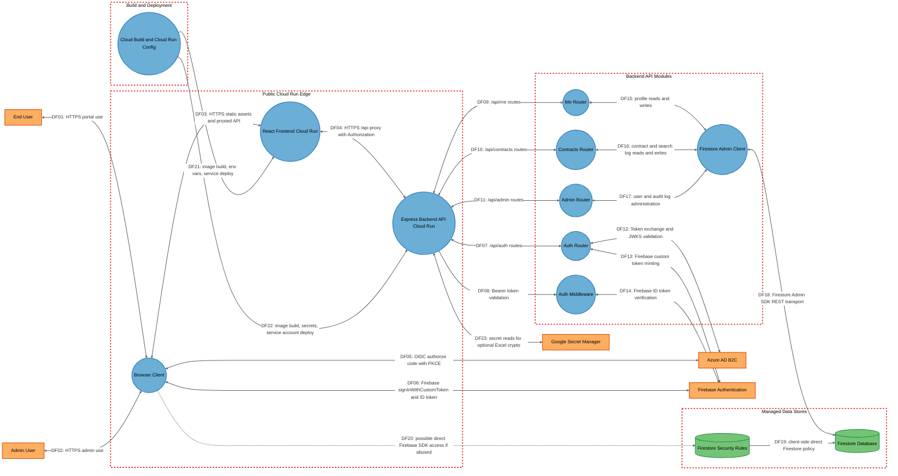

# Threat Model

## Data Flow Diagram

## Element Table

| Element | Type | TMT Category | Description | Trust Boundary |
|---------|------|--------------|-------------|----------------|
| EndUser | External Interactor | SE.EI.TMCore.User | Staff user performing contract lookup. | Internet |
| AdminUser | External Interactor | SE.EI.TMCore.User | Administrator performing privileged portal tasks. | Internet |
| BrowserClient | Process | SE.P.TMCore.BrowserClient | React SPA runtime and Firebase/Auth client. | PublicZone |
| NginxFrontend | Process | SE.P.TMCore.WebServer | nginx Cloud Run container serving the SPA and proxying `/api/`. | PublicZone |
| ExpressApi | Process | SE.P.TMCore.WebSvc | Express backend entry point and route dispatcher. | PublicZone |
| AuthRouter | Process | SE.P.TMCore.WebSvc | Public auth helper endpoints and ADB2C token bridge. | BackendServices |
| AuthMiddleware | Process | SE.P.TMCore.WebSvc | Bearer token validation and role/status hydration. | BackendServices |
| MeRouter | Process | SE.P.TMCore.WebSvc | Authenticated profile endpoint group. | BackendServices |
| ContractsRouter | Process | SE.P.TMCore.WebSvc | Contract search, bulk import, and purge endpoint group. | BackendServices |
| AdminRouter | Process | SE.P.TMCore.WebSvc | User, audit, and search-log admin endpoint group. | BackendServices |
| FirestoreAdminClient | Process | SE.P.TMCore.WebSvc | Firebase Admin SDK credential and Firestore wrapper. | BackendServices |
| FirestoreDatabase | Data Store | SE.DS.TMCore.NoSQL | Managed Firestore database storing portal data. | DataStorage |
| FirestoreRules | Data Store | SE.DS.TMCore.ConfigFile | Firestore rules policy protecting direct client access. | DataStorage |
| AzureADB2C | External Interactor | SE.EI.TMCore.AuthProvider | OIDC identity provider and JWKS/token endpoint. | ExternalServices |
| FirebaseAuth | External Interactor | SE.EI.TMCore.AuthProvider | Firebase identity service for ID tokens and custom-token sign-in. | ExternalServices |
| GoogleSecretManager | External Interactor | SE.EI.TMCore.Megaservice | Managed Google secret retrieval API. | ExternalServices |
| CloudBuildCloudRun | Process | SE.P.TMCore.WebSvc | Build and deploy configuration for Cloud Run services. | CICD |

## Data Flow Table

| ID | Source | Target | Protocol | Description |
|----|--------|--------|----------|-------------|
| DF01 | EndUser | BrowserClient | HTTPS | Staff uses the portal UI. |
| DF02 | AdminUser | BrowserClient | HTTPS | Admin uses the portal UI. |
| DF03 | BrowserClient | NginxFrontend | HTTPS | Browser loads SPA assets and sends proxied API calls. |
| DF04 | NginxFrontend | ExpressApi | HTTPS | nginx forwards `/api/` traffic with authorization headers. |
| DF05 | BrowserClient | AzureADB2C | HTTPS/OIDC | Browser performs authorization code flow with PKCE. |
| DF06 | BrowserClient | FirebaseAuth | HTTPS | Browser signs into Firebase with backend custom token and obtains ID tokens. |
| DF07 | ExpressApi | AuthRouter | HTTP in-process | Express dispatches `/api/auth` requests. |
| DF08 | ExpressApi | AuthMiddleware | HTTP in-process | Protected routes validate bearer tokens. |
| DF09 | ExpressApi | MeRouter | HTTP in-process | Express dispatches profile APIs. |
| DF10 | ExpressApi | ContractsRouter | HTTP in-process | Express dispatches contract APIs. |
| DF11 | ExpressApi | AdminRouter | HTTP in-process | Express dispatches admin APIs. |
| DF12 | AuthRouter | AzureADB2C | HTTPS/OIDC | Backend exchanges authorization codes and validates JWKS-backed ID tokens. |
| DF13 | AuthRouter | FirebaseAuth | HTTPS | Backend mints Firebase custom tokens. |
| DF14 | AuthMiddleware | FirebaseAuth | HTTPS | Backend verifies Firebase ID tokens. |
| DF15 | MeRouter | FirestoreAdminClient | SDK | Profile reads and updates. |
| DF16 | ContractsRouter | FirestoreAdminClient | SDK | Contract search/import/purge and search-log writes. |
| DF17 | AdminRouter | FirestoreAdminClient | SDK | User administration and log retrieval. |
| DF18 | FirestoreAdminClient | FirestoreDatabase | HTTPS/REST | Admin SDK uses Firestore REST transport. |
| DF19 | FirestoreRules | FirestoreDatabase | Policy evaluation | Rules govern direct client Firestore requests. |
| DF20 | BrowserClient | FirestoreRules | HTTPS/Firebase SDK | Possible direct client Firestore calls outside the supported app workflow. |
| DF21 | CloudBuildCloudRun | NginxFrontend | Docker/Cloud Run | Builds and deploys frontend image and environment. |
| DF22 | CloudBuildCloudRun | ExpressApi | Docker/Cloud Run | Builds and deploys backend image, service account, and secrets. |
| DF23 | ExpressApi | GoogleSecretManager | HTTPS | Backend optional Excel crypto helper reads keys. |

## Trust Boundary Table

| Boundary | Description | Contains |
|----------|-------------|----------|
| PublicZone | Public Cloud Run edge exposed to browsers and internet clients. | BrowserClient, NginxFrontend, ExpressApi |
| BackendServices | Backend module boundary where route handlers and middleware enforce application authorization. | AuthRouter, AuthMiddleware, MeRouter, ContractsRouter, AdminRouter, FirestoreAdminClient |
| DataStorage | Managed Firestore data and direct-client policy boundary. | FirestoreDatabase, FirestoreRules |
| CICD | Build and deployment configuration boundary controlled through GCP IAM. | CloudBuildCloudRun |
| ExternalServices | Managed identity and secret APIs outside this repository. | AzureADB2C, FirebaseAuth, GoogleSecretManager |
