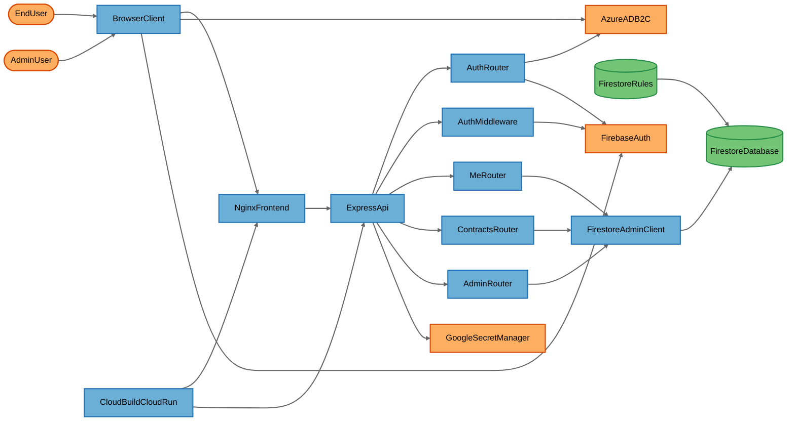
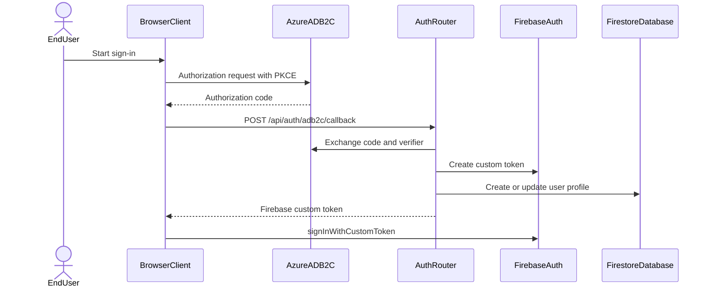
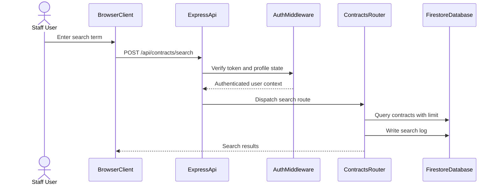
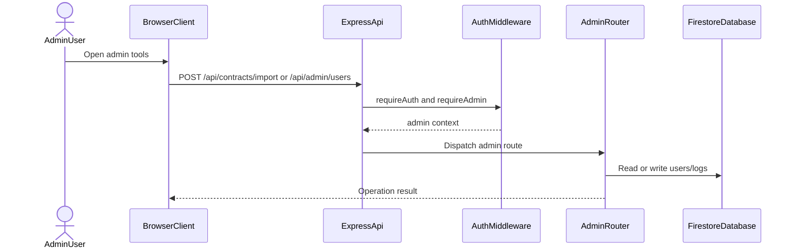

# Architecture Overview

## System Purpose

Bridge Portal is a contract-status portal that allows authenticated staff to search contract records, upload contract datasets, and administer portal users. The current implementation routes business data access through an Express backend API, uses Azure AD B2C plus Firebase custom tokens for sign-in, and relies on Firestore Security Rules as a client-side backstop.

## Key Components

| Component | Type | Description |
|-----------|------|-------------|
| EndUser | External Interactor | Staff user accessing the portal from a browser. |
| AdminUser | External Interactor | Privileged operator managing users, logs, and imports. |
| BrowserClient | Process | React SPA that handles PKCE login, Firebase sign-in, and API calls. |
| NginxFrontend | Process | nginx-based Cloud Run frontend that serves static assets and proxies /api traffic. |
| ExpressApi | Process | Express entrypoint that exposes auth, profile, contract, and admin APIs. |
| AuthRouter | Process | Backend route group for login resolution and ADB2C callback exchange. |
| AuthMiddleware | Process | Bearer-token validator and role/status context loader. |
| MeRouter | Process | Authenticated profile read and update endpoints. |
| ContractsRouter | Process | Contract search, import, and purge endpoints. |
| AdminRouter | Process | Admin user-management and log-retrieval endpoints. |
| FirestoreAdminClient | Process | Firebase Admin SDK wrapper used by backend routes. |
| FirestoreDatabase | Data Store | Firestore collections for users, contracts, search logs, and audit logs. |
| FirestoreRules | Data Store | Firestore Security Rules that govern direct client access. |
| AzureADB2C | External Service | Azure AD B2C identity provider used for OIDC and token exchange. |
| FirebaseAuth | External Service | Firebase Authentication service for ID token verification and custom tokens. |
| GoogleSecretManager | External Service | Optional secret store used for crypto keys and backend secrets. |
| CloudBuildCloudRun | Process | Cloud Build and Cloud Run deployment definitions for the platform services. |

## Component Diagram

## Top Scenarios

### Scenario 1: Staff Login Through ADB2C and Firebase

A browser user starts an Azure AD B2C PKCE flow, the backend exchanges the code for an ID token, validates the token, and returns a Firebase custom token so the SPA can sign in. The main trust decision is in the backend auth router and middleware, not in the browser.

### Scenario 2: Contract Search Through the Backend API

Authenticated staff search contracts by MSISDN or billing account number through the Express API. The request is validated by auth middleware, run against Firestore through the Admin SDK, and logged for auditing when results exist.

### Scenario 3: Admin Import and Log Management

Privileged users upload contract files and manage users through backend routes that enforce admin roles and write audit records. These flows are gated by middleware and rate limiting before they reach Firestore.

## Technology Stack

| Layer | Technologies |
|-------|--------------|
| Languages | TypeScript, JavaScript, Firestore Rules, YAML |
| Frameworks | React, Vite, Express, Firebase client SDK, Firebase Admin SDK |
| Data Stores | Firestore collections for users, contracts, audit_logs, and search_logs |
| Infrastructure | Google Cloud Run, Cloud Build, Docker, nginx |
| Security | Azure AD B2C OIDC with PKCE, Firebase Auth custom tokens, Helmet, CORS allow-listing, Firestore Security Rules |

## Deployment Model

The application is deployed as a public two-service Cloud Run environment. The frontend nginx container listens on port 8080 and proxies /api traffic to the backend Cloud Run service. The backend API is reachable over the public internet and uses application-level bearer-token validation for protected routes. Firestore and Firebase Auth are managed external services, and backend secrets are expected to be injected through Cloud Run Secret Manager bindings.

**Deployment Classification:** `NETWORK_SERVICE`

### Component Exposure Table

| Component | Listens On | Auth Required | Reachability | Min Prerequisite | Derived Tier |
|-----------|------------|---------------|--------------|------------------|-------------|
| EndUser | N/A — no listener | No | No Listener | Host/OS Access | T3 |
| AdminUser | N/A — no listener | No | No Listener | Host/OS Access | T3 |
| BrowserClient | N/A — browser runtime | Yes (Firebase session after login) | No Listener | Host/OS Access | T3 |
| NginxFrontend | 0.0.0.0:8080 | No for static assets | External | None | T1 |
| ExpressApi | 0.0.0.0:8080 | Mixed: public auth endpoints and bearer token on protected routes | External | None | T1 |
| AuthRouter | In-process under ExpressApi | No for resolve-login and callback pre-token | External | None | T1 |
| AuthMiddleware | In-process under ExpressApi | Yes (Bearer token) | External | Authenticated User | T2 |
| MeRouter | In-process under ExpressApi | Yes (requireAuth) | External | Authenticated User | T2 |
| ContractsRouter | In-process under ExpressApi | Yes (requireAuth) | External | Authenticated User | T2 |
| AdminRouter | In-process under ExpressApi | Yes (requireAdmin) | External | Privileged User | T2 |
| FirestoreAdminClient | N/A — outbound SDK wrapper | Service account credentials | No Listener | Host/OS Access | T3 |
| FirestoreDatabase | Managed Firestore endpoint | Firebase/Google IAM and Firestore Rules | External | Authenticated User | T2 |
| FirestoreRules | Firestore policy evaluator | Firebase authentication context | External | Authenticated User | T2 |
| AzureADB2C | Managed public OIDC endpoint | OIDC controls | External | None | T1 |
| FirebaseAuth | Managed public auth endpoint | Provider credentials | External | None | T1 |
| GoogleSecretManager | Managed Google API | Cloud Run service account IAM | External | Admin Credentials | T3 |
| CloudBuildCloudRun | Build pipeline and deployment | GCP IAM | No Listener | Admin Credentials | T3 |

## Security Infrastructure Inventory

| Component | Security Role | Configuration | Notes |
|-----------|---------------|---------------|-------|
| Helmet | HTTP hardening | `app.use(helmet())` | Adds common security headers on the backend. |
| CORS allow-list | Browser-origin restriction | `ALLOWED_ORIGINS` and runtime validation | Prevents unapproved browser origins from calling the API. |
| AuthMiddleware | Token validation and role context | Firebase ID token and ADB2C JWT verification | Enforces authenticated access on protected routes. |
| FirestoreRules | Direct-client authorization backstop | Default deny plus per-collection rules | Protects Firestore from direct SDK access. |
| RateLimiter | Request throttling | In-memory per-IP buckets for import/search/admin routes | Reduces abuse on privileged endpoints. |
| GoogleSecretManager | Secret storage | Optional secret binding and helper service | Keeps sensitive keys outside source files. |
| Cloud Build | Deployment automation | CI/CD deploys backend with allow-unauthenticated and secret bindings | Security posture depends on runtime configuration. |

## Repository Structure

| Directory | Purpose |
|-----------|---------|
| src/ | React frontend, auth context, pages, and API client. |
| backend/src/ | Express server, middleware, route handlers, and services. |
| public/ | Static assets and placeholder content. |
| skills/ | Threat-model and web-coder guidance documents. |
