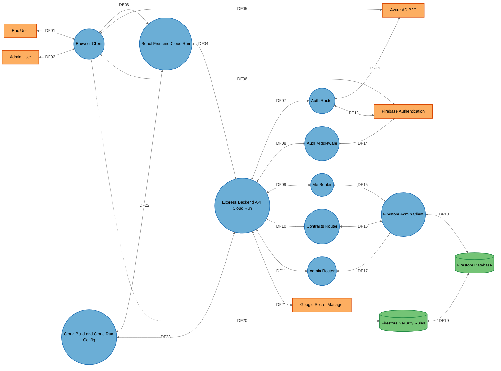
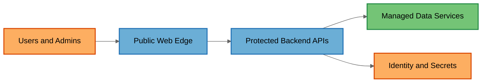

# Threat Model

## Data Flow Diagram

## Element Table

| Element | Type | TMT Category | Description | Trust Boundary |
|---------|------|--------------|-------------|----------------|
| EndUser | External Interactor | SE.EI.TMCore.User | Staff user accessing the portal. | PublicZone |
| AdminUser | External Interactor | SE.EI.TMCore.User | Privileged user managing portals tasks. | PublicZone |
| BrowserClient | Process | SE.P.TMCore.BrowserClient | React SPA and Firebase client runtime. | PublicZone |
| NginxFrontend | Process | SE.P.TMCore.WebServer | nginx frontend serving the SPA and proxying /api. | PublicZone |
| ExpressApi | Process | SE.P.TMCore.WebSvc | Express API entrypoint and route dispatcher. | PublicZone |
| AuthRouter | Process | SE.P.TMCore.WebSvc | Public auth routes and ADB2C token bridge. | BackendServices |
| AuthMiddleware | Process | SE.P.TMCore.WebSvc | Token validation and role/status hydration. | BackendServices |
| MeRouter | Process | SE.P.TMCore.WebSvc | Profile read and write endpoints. | BackendServices |
| ContractsRouter | Process | SE.P.TMCore.WebSvc | Contract search/import/purge endpoints. | BackendServices |
| AdminRouter | Process | SE.P.TMCore.WebSvc | Admin user and log management endpoints. | BackendServices |
| FirestoreAdminClient | Process | SE.P.TMCore.WebSvc | Firebase Admin SDK wrapper. | BackendServices |
| FirestoreDatabase | Data Store | SE.DS.TMCore.NoSQL | Firestore collections for portal data. | DataStorage |
| FirestoreRules | Data Store | SE.DS.TMCore.ConfigFile | Firestore rules controlling client access. | DataStorage |
| AzureADB2C | External Interactor | SE.EI.TMCore.AuthProvider | Microsoft identity provider. | ExternalServices |
| FirebaseAuth | External Interactor | SE.EI.TMCore.AuthProvider | Firebase identity provider. | ExternalServices |
| GoogleSecretManager | External Interactor | SE.EI.TMCore.Megaservice | Managed secret storage. | ExternalServices |
| CloudBuildCloudRun | Process | SE.P.TMCore.WebSvc | Build and deployment automation. | CICD |

## Data Flow Table

| ID | Source | Target | Protocol | Description |
|----|--------|--------|----------|-------------|
| DF01 | EndUser | BrowserClient | HTTPS | Standard portal use. |
| DF02 | AdminUser | BrowserClient | HTTPS | Admin portal interaction. |
| DF03 | BrowserClient | NginxFrontend | HTTPS | SPA load and API proxying. |
| DF04 | NginxFrontend | ExpressApi | HTTPS | Forwarded /api requests. |
| DF05 | BrowserClient | AzureADB2C | HTTPS/OIDC | PKCE authorization flow. |
| DF06 | BrowserClient | FirebaseAuth | HTTPS | Firebase custom token sign-in. |
| DF07 | ExpressApi | AuthRouter | In-process | Route dispatch. |
| DF08 | ExpressApi | AuthMiddleware | In-process | Token validation. |
| DF09 | ExpressApi | MeRouter | In-process | Profile API dispatch. |
| DF10 | ExpressApi | ContractsRouter | In-process | Contract API dispatch. |
| DF11 | ExpressApi | AdminRouter | In-process | Admin API dispatch. |
| DF12 | AuthRouter | AzureADB2C | HTTPS/OIDC | Token exchange and JWKS validation. |
| DF13 | AuthRouter | FirebaseAuth | HTTPS | Custom token creation. |
| DF14 | AuthMiddleware | FirebaseAuth | HTTPS | ID token verification. |
| DF15 | MeRouter | FirestoreAdminClient | SDK | Profile reads and writes. |
| DF16 | ContractsRouter | FirestoreAdminClient | SDK | Contract reads and writes. |
| DF17 | AdminRouter | FirestoreAdminClient | SDK | User and log management. |
| DF18 | FirestoreAdminClient | FirestoreDatabase | HTTPS/REST | Firestore access. |
| DF19 | FirestoreRules | FirestoreDatabase | Policy evaluation | Rules govern direct client access. |
| DF20 | BrowserClient | FirestoreRules | HTTPS/Firebase SDK | Possible direct SDK access outside the app flow. |
| DF21 | ExpressApi | GoogleSecretManager | HTTPS | Optional secret reads. |
| DF22 | CloudBuildCloudRun | NginxFrontend | Docker/Cloud Run | Frontend deploy. |
| DF23 | CloudBuildCloudRun | ExpressApi | Docker/Cloud Run | Backend deploy. |

## Trust Boundary Table

| Boundary | Description | Contains |
|----------|-------------|----------|
| PublicZone | Public web edge exposed to browsers. | BrowserClient, NginxFrontend, ExpressApi |
| BackendServices | Backend module boundary with route and middleware enforcement. | AuthRouter, AuthMiddleware, MeRouter, ContractsRouter, AdminRouter, FirestoreAdminClient |
| DataStorage | Managed database and direct-client policy boundary. | FirestoreDatabase, FirestoreRules |
| ExternalServices | Managed identity and secret services. | AzureADB2C, FirebaseAuth, GoogleSecretManager |
| CICD | Build and deployment boundary. | CloudBuildCloudRun |

## Summary View

## Summary to Detailed Mapping

| Summary Element | Contains | Summary Flows | Maps to Detailed Flows |
|-----------------|----------|---------------|------------------------|
| Users and Admins | EndUser, AdminUser | SDF01 | DF01, DF02 |
| Public Web Edge | BrowserClient, NginxFrontend | SDF02 | DF03, DF04, DF05, DF06 |
| Protected Backend APIs | ExpressApi, AuthRouter, AuthMiddleware, MeRouter, ContractsRouter, AdminRouter | SDF03 | DF07, DF08, DF09, DF10, DF11, DF12, DF13, DF14, DF15, DF16, DF17 |
| Managed Data Services | FirestoreDatabase, FirestoreRules | SDF04 | DF18, DF19, DF20 |
| Identity and Secrets | AzureADB2C, FirebaseAuth, GoogleSecretManager | SDF05 | DF05, DF06, DF12, DF13, DF14, DF21 |
